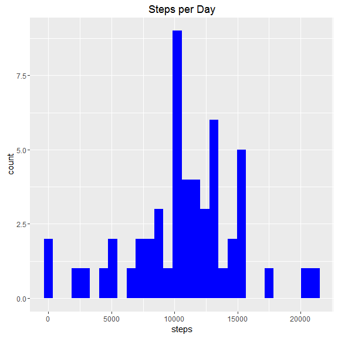
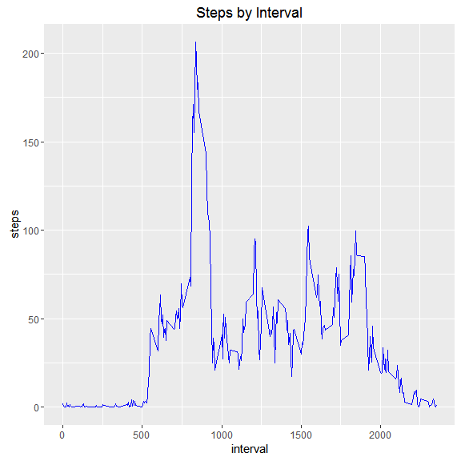
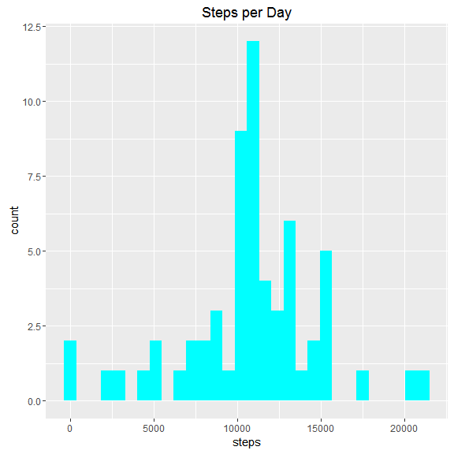
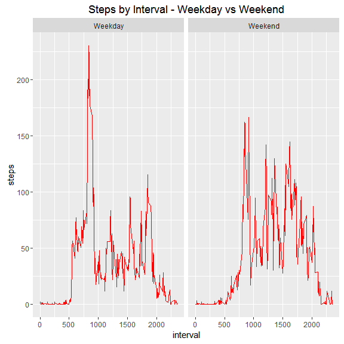

# Reproducible Research : Assignment #1


## Loading the Data and Library

Load data from the csv file

```r
actvt <- read.csv("activity.csv", na.strings="NA")
```

We will be using GGPLOT for the charts  
Load the required ggplot2 library


```r
require("ggplot2")
```

```
## Loading required package: ggplot2
```

```
## Warning: package 'ggplot2' was built under R version 3.2.5
```


##Q1 : What is the mean total number of steps taken per day?
For this part of the assignment, ignore the missing values in the dataset

1.Make a histogram of the total number of steps taken each day  
--Aggregate 'steps' by date  
--Plot 'Steps per Day' using qplot

```r
sum_steps <- aggregate(steps ~ date, data = actvt, FUN = sum)
qplot(steps, data=sum_steps, main="Steps per Day", fill=I("blue"))
```

```
## `stat_bin()` using `bins = 30`. Pick better value with `binwidth`.
```

<!-- -->

mean and median of the total number of steps taken per day


```r
mean(sum_steps$steps)
```

```
## [1] 10766.19
```

```r
median(sum_steps$steps)
```

```
## [1] 10765
```
  
##Q2 : What is the average daily activity pattern?
  
1.Make a time series plot (i.e. type = "l") of the 5-minute interval (x-axis) and the average number of steps taken, averaged across all days (y-axis)

```r
stepsXintvl <- aggregate(steps ~ interval, data = actvt, FUN = mean)
p <- ggplot(stepsXintvl, aes(x = interval, y = steps))
p + geom_line(color="blue") + ggtitle("Steps by Interval")
```

<!-- -->
  
2.Which 5-minute interval, on average across all the days in the dataset, contains the maximum number of steps?

```r
with (stepsXintvl, {interval[which.max(steps)]})
```

```
## [1] 835
```
  
##Q3 : Imputing missing values
  
1.Calculate and report the total number of missing values in the dataset (i.e. the total number of rows with NAs)  

```r
sum(is.na(actvt))
```

```
## [1] 2304
```

2.Devise a strategy for filling in all of the missing values in the dataset. The strategy does not need to be sophisticated. For example, you could use the mean/median for that day, or the mean for that 5-minute interval, etc.
--using 5-minute inteval to replace NAs

```r
require("plyr")
```

```
## Loading required package: plyr
```

```r
actvt_join <-  join(actvt, stepsXintvl, by = "interval") 
names(actvt_join)[4] <- "steps_int_mean"
```

3.Create a new dataset that is equal to the original dataset but with the missing data filled in 

```r
nas <- is.na(actvt$steps)  #find all NAs
actvt_replace_na <- actvt_join   #create new dataset
actvt_replace_na$steps[nas] <- actvt_replace_na$steps_int_mean[nas]  #replace NAs
#remove original means column
actvt_replace_na <- subset( actvt_replace_na, select = -steps_int_mean )
```

4.Make a histogram of the total number of steps taken each day and Calculate and report the mean and median total number of steps taken per day. Do these values differ from the estimates from the first part of the assignment? What is the impact of imputing missing data on the estimates of the total daily number of steps?


```r
stepsXdate_imputed <- aggregate(steps ~ date, data=actvt_replace_na, FUN=sum)
qplot(steps, data=stepsXdate_imputed, main="Steps per Day", fill=I("cyan"))
```

```
## `stat_bin()` using `bins = 30`. Pick better value with `binwidth`.
```

<!-- -->

```r
mean(stepsXdate_imputed$steps)
```

```
## [1] 10766.19
```

```r
median(stepsXdate_imputed$steps)
```

```
## [1] 10766.19
```

  
##Q3 : Are there differences in activity patterns between weekdays and weekends?
1.Create a new factor variable in the dataset with two levels - "weekday" and "weekend" indicating whether a given date is a weekday or weekend day.
--use weekdays() function to check for weekday or weekend, create new Factor variable typeofday

```r
typeOfDay <- function(date){
    if(weekdays(as.Date(date,"%m/%d/%Y")) %in% c("Saturday", "Sunday")) {
        "Weekend"
    }
    else{
        "Weekday"
    }
}
actvt_replace_na$typeofday <- with(actvt_replace_na,{as.factor(sapply(date, typeOfDay))})
```


2.Make a panel plot containing a time series plot (i.e. type = "l") of the 5-minute interval (x-axis) and the average number of steps taken, averaged across all weekday days or weekend days (y-axis). See the README file in the GitHub repository to see an example of what this plot should look like using simulated data

```r
#find the mean by typeofday, and interval
stepsXtodXintvl <- aggregate(actvt_replace_na$steps,list(typeofday=actvt_replace_na$typeofday,interval=actvt_replace_na$interval),mean)
#rename steps
names(stepsXtodXintvl)[3] <- "steps"
p <- ggplot(stepsXtodXintvl, aes(x = interval, y = steps))
p + geom_line(color="red") + facet_grid(. ~ typeofday) + ggtitle("Steps by Interval - Weekday vs Weekend")
```

<!-- -->

There's a distinct spike in early morning activity on weekdays.  Activity during the weekend is more evenly distributed throughout the day.
